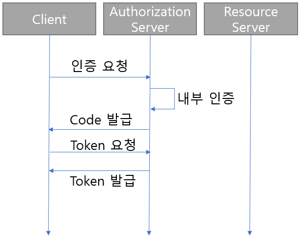
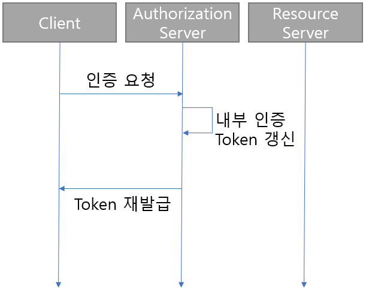
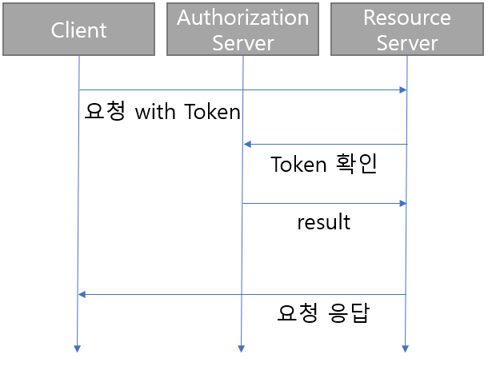
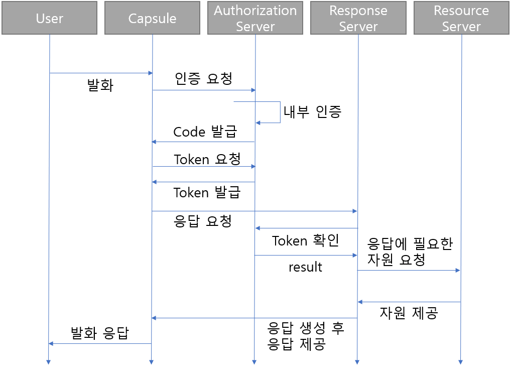

# OAuth_example
OAuth example authorization &  server

간단한 OAuth 서버입니다. 
다만 spring-security-oauth2.0 은 사용하지 않았습니다. OAuth 2.0 framework 을 나름 customizing 하여 적용한 server입니다. 

 
1. userController 를 이용해서 강제로 계정 생성 
2. 해당 계정을 통해 OAuth 통신을 통해 token 발급 
3. /simpleData/get을 통해 data 를 가져오면 성공   

> spec
>- java 
>- postgreSQL 
>- JPA 
>- Spring boot  
>- No spring-security

# Default OAuth 2.0 flow

>가장 많이 쓰이는 형태 ~~제가 겪었던 client~~ 의 OAuth 2.0 은 
grant_type : authorization_code / token_type : bearer 
을 사용하기 때문에 위 기준으로 진행하였습니다.

OAuth 2.0 의 flow는

1. Authorize
    - grant_type : authorization_code
    - grant_type : refresh_token

2. Access with Access_Token

3. authorization token, and response

의 flow로 이루어져 있습니다.

Authorize with grant_type, authorization_code
---

<code>grant_type=authorization_code</code> 일 경우에 대한 Authorization 부분입니다.

authorization_code 로 token 을 발급 받을 시의 flow 입니다.

Resource Server 에 접근 하기 전, Authorization Server 를 통해 인증 과정을 거칩니다.

내부 인증은 각 Resource Server 에서 제시하는 ID/PW 기반의 login 혹은,  
개인 정보를 이용한 본인 인증 등의 과정을 통과해야 하며, 인증 완료 후 client 는 code 를 response 로 받게 됩니다.

Authorize with grant_type, refresh_token
---

<code>grant_type=refresh_token</code> 일 경우에 대한 Authorization 부분입니다.

인증 요청 시 grant_type 을 refresh_token 으로 할 경우, 내부 인증에서 client 가 추가 인증을 하는 대신 
발급된 refresh_token 으로 재발급이 이루어집니다.

Access with access_token
---
token 발급 이후 <code>access_token</code> 을 통해 Resource  Server 에 접근 시 flow 입니다.

Authorize 이후 token 을 정상적으로 발급 받게 되면, header 부분에 Authorization 이라는 이름으로 parameter 가 제공되는데,
여기에 **Bearer ACCESS_TOKEN** 의 형식으로 token 이 전달됩니다.

이후 Resource Server 에선 token-check end-point 혹은 각 check_token method 를 만들어 각 method 별 check_token 과정을 진행합니다.

check 결과에 따라 Resource 를 제공해주면 1회 호출에 대한 flow 는 완료됩니다. 

# Capsule Custom OAuth 2.0 flow

위의 일반적인 flow 를 모두 합치고, Bixby Capsule 발화에 대한 Response Server 를 별도로 둔 Custom OAuth 2.0 flow 입니다.

Client 대신 User 와 Capsule 이 추가되었으며, 전체 project 에 접근하는 request 가 /check_token 으로 접근하지 않고
각 method 별로 check token 을 넣었습니다.

또한 Authorize Server, Resource Server, Response Server 를 분리하지 않았습니다. 

OAuth 2.0 framework uri : https://www.oauth.com   

# 각 controller 별 구성

>- UserController
>- TokenController
>- LoginController
>- SimpleDataController

각 controller 별 주석 참조

